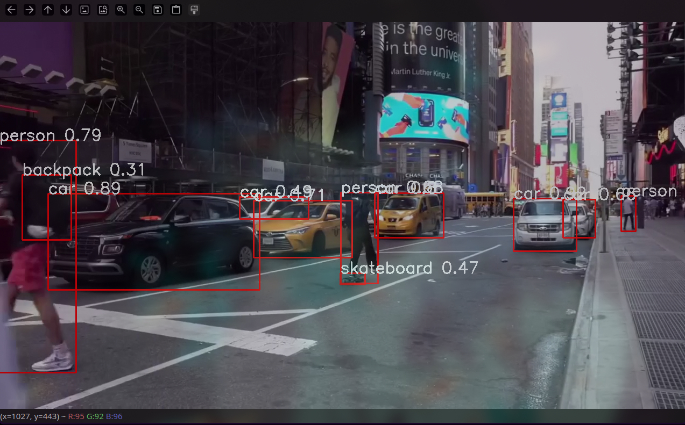
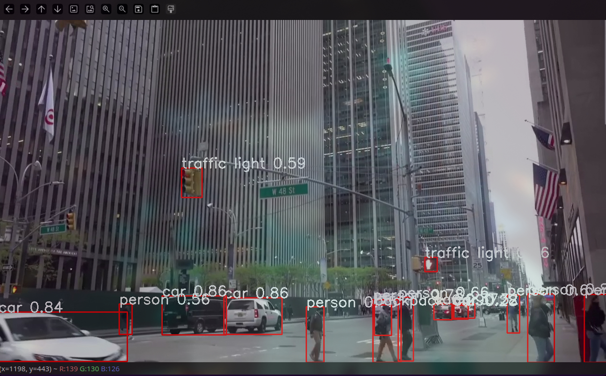

# Real-Time YOLOv8 Object Detection with a Multithreaded Pipeline

![Python Version][python-shield]
![MIT License][license-shield]
![Stargazers][stars-shield]
![Forks][forks-shield]

An optimized, high-performance object detection application that uses YOLOv8 and a multithreaded architecture to process live webcam feeds with minimal latency and high frame rates.

---

<table>
  <tr>
    <td align="center">
      
      <br>
      <em>Caption: Detecting multiple objects in real-time.</em>
    </td>
    <td align="center">
      
      <br>
      <em>Caption: High confidence detection of a mobile phone.</em>
    </td>
  </tr>
</table>

---

## Table of Contents

1.  [About The Project](#about-the-project)
2.  [Key Features](#key-features)
3.  [Technical Architecture](#technical-architecture)
4.  [Getting Started](#getting-started)
    * [Prerequisites](#prerequisites)
    * [Installation](#installation)
5.  [Usage & Configuration](#usage--configuration)
6.  [Contributing](#contributing)
7.  [License](#license)
8.  [Acknowledgements](#acknowledgements)

---

## About The Project

Standard, single-threaded video processing applications often suffer from performance bottlenecks. The time it takes a model to perform inference on a frame can block the program from capturing the next frame, leading to stuttering and a low effective FPS.

This project solves that problem by implementing a decoupled, multithreaded pipeline. It separates the I/O-bound task (capturing frames) from the CPU/GPU-bound task (running the YOLOv8 model), ensuring a smooth, real-time video output.

## Key Features

-   **High-Performance Detection:** Utilizes the fast and efficient **YOLOv8n** model from Ultralytics.
-   **Optimized & Non-Blocking:** A multithreaded design using thread-safe queues prevents inference latency from dropping video frames.
-   **Real-Time Processing:** Captures and processes video directly from a live webcam feed.
-   **Easy to Set Up:** Minimal dependencies and includes a `requirements.txt` for one-command installation.
-   **Automatic Model Download:** The required YOLOv8 model is downloaded automatically on the first run.

## Technical Architecture

The core of this application's performance lies in its concurrent design, which uses two primary daemon threads and two queues to manage the flow of data.

```
+-----------+      +-----------------+      +-------------+
|           |----->|  Capture Thread |----->|             |
|  Webcam   |      +-----------------+      | Frame Queue |
| (Source)  |                               | (maxsize=1) |
+-----------+                               +-------------+
                                                  |
                                                  |
                                                  v
+----------------+      +------------------+      +------------------+
|                |<-----|  Results Queue   |<-----| Inference Thread |
|  Main Thread   |      |   (maxsize=1)    |      | (YOLOv8 Model)   |
|  (cv2.imshow)  |      +------------------+      +------------------+
+----------------+
```

1.  **Capture Thread:** This thread's sole responsibility is to grab frames from the webcam as fast as possible. It puts the latest frame into the `frame_queue`, overwriting any old frame that hasn't been processed yet. This ensures the inference thread always works on the most recent data.
2.  **Inference Thread:** This thread continuously pulls frames from the `frame_queue`, runs the YOLOv8 model on them, draws the bounding boxes, and pushes the final, annotated image to the `results_queue`.
3.  **Main Thread:** The main thread is responsible only for displaying the processed image from the `results_queue`. Since it doesn't wait for inference, it can update the display smoothly.

## Getting Started

Follow these instructions to set up and run the project on your local machine.

### Prerequisites

Make sure you have the following installed:
* **Python 3.8+**
* **Git** for cloning the repository.
* **Pip** for installing packages.

### Installation

1.  **Clone the repository:**
    ```sh
    git clone [https://github.com/your-username/your-repository-name.git](https://github.com/your-username/your-repository-name.git)
    cd your-repository-name
    ```

2.  **Create and activate a virtual environment (recommended):**
    ```sh
    # For macOS/Linux
    python3 -m venv venv
    source venv/bin/activate

    # For Windows
    python -m venv venv
    venv\Scripts\activate
    ```

3.  **Install the required dependencies:**
    ```sh
    pip install -r requirements.txt
    ```

## Usage & Configuration

Once the setup is complete, you can run the application with a single command:

```sh
python obj_det_v2.py
```
- Press the `q` key on the OpenCV window to terminate the program.

#### Configuration
You can easily modify the script `obj_det_v2.py` to change key parameters:

-   **Change Camera Source:** Modify the `VideoCapture` index in `main()`. `0` is typically the built-in webcam.
    ```python
    # In the main() function
    cap = cv2.VideoCapture(0) # Change 0 to 1, 2, etc., for other cameras
    ```

-   **Use a Different YOLO Model:** Change the model path. The `ultralytics` library will automatically download any official YOLOv8 model if not found locally.
    ```python
    # In the main() function
    model = YOLO("yolo-weights/yolov8s.pt") # e.g., use the 'small' model
    ```

-   **Adjust Confidence Threshold:** Modify the `conf` parameter in the inference thread to filter out detections with low confidence.
    ```python
    # In the inference_thread() function
    results = model(img, stream=True, conf=0.5) # Change 0.5 to your desired value
    ```

## Contributing

Contributions are what make the open-source community such an amazing place to learn, inspire, and create. Any contributions you make are **greatly appreciated**.

To contribute:
1.  Fork the Project
2.  Create your Feature Branch (`git checkout -b feature/AmazingFeature`)
3.  Commit your Changes (`git commit -m 'Add some AmazingFeature'`)
4.  Push to the Branch (`git push origin feature/AmazingFeature`)
5.  Open a Pull Request

## License

Distributed under the MIT License. See `LICENSE` for more information.

## Acknowledgements
-   [Ultralytics](https://www.ultralytics.com/) for the YOLOv8 model and Python package.
-   [OpenCV](https://opencv.org/) for the powerful computer vision library.
-   [Shields.io](https://shields.io) for the professional README badges.

[python-shield]: https://img.shields.io/badge/Python-3.8+-blue.svg
[python-url]: https://www.python.org/
[license-shield]: https://img.shields.io/github/license/dattanirjhar/Object-Detection-with-YOLOV8.svg
[license-url]: https://github.com/dattanirjhar/Object-Detection-with-YOLOV8/blob/main/LICENSE
[stars-shield]: https://img.shields.io/github/stars/dattanirjhar/Object-Detection-with-YOLOV8.svg
[stars-url]: https://github.com/dattanirjhar/Object-Detection-with-YOLOV8/stargazers
[forks-shield]: https://img.shields.io/github/forks/dattanirjhar/Object-Detection-with-YOLOV8.svg
[forks-url]: https://github.com/dattanirjhar/Object-Detection-with-YOLOV8/network/members
